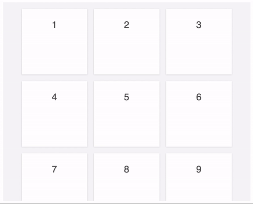
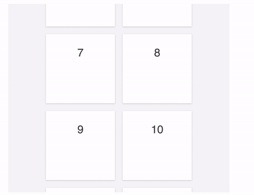
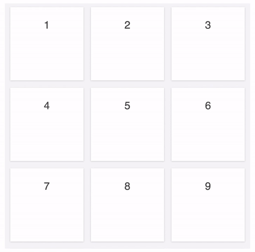
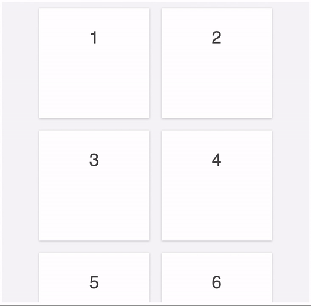
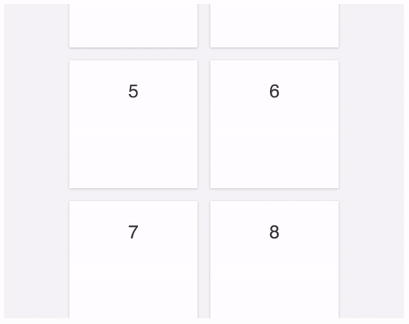

# collection-view

A container for displaying large ordered collections of data items and presenting them using
arbitrary layouts. Large collections can be scrolled smoothly by displaying only a limited
number of elements. This is also known as "windowing" or "virtualization".
[Changes to the data](#changing-the-data) (remove, add, move) and
[changes to the layout](#changing-the-layout) are properly animated by the collection view.
The library is inspired by iOS'
[UICollectionView](https://developer.apple.com/library/ios/documentation/UIKit/Reference/UICollectionView_class/)
and Android's RecyclerView.

The collection view gets its data from the [delegate](#delegate) and gets its visual information
from the layout. Currently there is a [grid layout](#grid-layout), which presents the collection
in rows and columns, and a simple [list layout](#list-layout), which presents the collection
in rows, but [custom layouts](#custom-layout) can be implemented easily. Contributions are welcome!



The collection view also handles resizing of the container properly, maintaining the current
position in the collection.




## Usage

```js
import { CollectionView, GridLayout } from 'collection-view'

class Delegate {
  constructor(items) {
    this.items = items
  }

  getCount() {
    return this.items.length
  }
  
  configureElement(element, index) {
    element.textContent = this.items[index]
  }
}

let items = ["Item 1", "Item 2", "Item 3", "Item 4", "Item 5", "Item 6", "Item 7", "Item 8", "Item 9", "Item 10"]
let delegate = new Delegate(items)
let layout = new GridLayout()
let contentElement = document.getElementById('content')
let view = new CollectionView(contentElement, layout, delegate)
```

Implement a [delegate](#delegate) for your collection. Instantiate a layout, like
a [grid](#grid-layout) or [list](#list-layout), and configure it. Finally, instantiate
a collection view, providing the DOM element which should contain the elements representing
the items in the collection, the layout, and the delegate.

If the grid or list layouts do not fit your needs you can also
[implement a custom layout](#custom-layout).


## Delegate

The delegate object is responsible for defining how many items the collection view should display
and configuring the elements corresponding to the items.

- **getCount(): _number_** (required)

  Return the number of items in the collection.

  Similar to [`UICollectionViewDataSource.collectionView(numberOfItemsInSection:)`](https://developer.apple.com/library/ios/documentation/UIKit/Reference/UICollectionViewDataSource_protocol/#//apple_ref/occ/intfm/UICollectionViewDataSource/collectionView:numberOfItemsInSection:)

- **configureElement(element: _Element_, index: _number_)** (required)

  Configure the DOM element that corresponds to the item in the collection at the given index.
  The element might have previously been used to represent another item in the collection,
  so ensure to properly restore it to its initial state (e.g., remove previously registered
  event listeners).

  Similar to
[`UICollectionViewDataSource.collectionView(cellForItemAtIndexPath:)`](https://developer.apple.com/library/ios/documentation/UIKit/Reference/UICollectionViewDataSource_protocol/#//apple_ref/occ/intfm/UICollectionViewDataSource/collectionView:cellForItemAtIndexPath:)

- **onScroll(view: _CollectionView_)** (optional)

  Callback when the collection view is scrolled.

  Similar to [`UIScrollViewDelegate.scrollViewDidScroll:`](https://developer.apple.com/library/ios/documentation/UIKit/Reference/UIScrollViewDelegate_Protocol/#//apple_ref/occ/intfm/UIScrollViewDelegate/scrollViewDidScroll:)


## Changing the data

The collection view supports transitions between different collections. As it is not aware
of the underlying data itself, the changes have to be provided to the collection view explicitly,
in the form of the indices of the items which were removed, added, and moved, passed to the method:

**changeIndices(removed: _number[]_, added: _number[]_, moved: _Map.<number, number>_)**

* **removed:**

  Indices which were removed, referring to the collection before the changes

* **added:**

  Indices which were added, referring to the collection after the changes

* **moved:**

  Indices which were moved. The keys are indices referring to the collection before the changes,
  and the values are indices referring to the collection after the changes. 

  May also be passed as an _Object.<string, number>_



For example, when transitioning from the original collection [1, 2, 3, 4, 5, 6, 7, 8, 9, 10, 11]
to the target collection [1, 15, 16, 3, 6, 8, 4, 10, 11]:

* The items at indices [1, 4, 6, 8] in the original collection are not in the
  target collection anymore (**removed**):

  [1, **2**, 3, 4, **5**, 6, **7**, 8, **9**, 10, 11]

* The items at indices [1, 2] in the target collection are new in the target collection
  (**added**):

  [1, **15**, **16**, 3, 6, 8, 4, 10, 11]

* The item at index 3 in the original collection is now at index 6 in the target collection
  (**moved**):

  [1, 2, 3, **4**, 5, 6, 7, 8, 9, 10, 11]

  [1, 15, 16, 3, 6, 8, **4**, 10, 11]

Therefore, the method call would be `changeIndices([1, 4, 6, 8], [1, 2] {3: 6})`.

Similar to calling
[`UICollectionView.deleteItemsAtIndexPaths()`](https://developer.apple.com/library/ios/documentation/UIKit/Reference/UICollectionView_class/index.html#//apple_ref/occ/instm/UICollectionView/deleteItemsAtIndexPaths:),
[`UICollectionView.insertItemsAtIndexPaths()`](https://developer.apple.com/library/ios/documentation/UIKit/Reference/UICollectionView_class/index.html#//apple_ref/occ/instm/UICollectionView/insertItemsAtIndexPaths:),
and multiple
[`UICollectionView.moveItemAtIndexPath(toIndexPath:)`](https://developer.apple.com/library/ios/documentation/UIKit/Reference/UICollectionView_class/index.html#//apple_ref/occ/instm/UICollectionView/moveItemAtIndexPath:toIndexPath:)
in a call to
[`UICollectionView.performBatchUpdates(completion:)`](https://developer.apple.com/library/ios/documentation/UIKit/Reference/UICollectionView_class/index.html#//apple_ref/occ/instm/UICollectionView/performBatchUpdates:completion:)


## Grid layout

The `GridLayout` displays collection items in a grid. All items are the same size and flow from
one row or column (depending on the direction) to the next.

It is similar to [`UICollectionViewFlowLayout`](https://developer.apple.com/library/ios/documentation/UIKit/Reference/UICollectionViewFlowLayout_class/).


* **direction: _GridLayoutDirection_**

  The direction in which the collection view scrolls. If `GridLayoutDirection.VERTICAL`,
  the collection view scrolls vertically and items flow in rows from left to right.
  If `GridLayoutDirection.HORIZONTAL`, the collection view scrolls horizontally and items
  flow in columns from top to bottom.

  Default: `GridLayoutDirection.VERTICAL`

  Similar to [`UICollectionViewFlowLayout.scrollDirection`](https://developer.apple.com/library/ios/documentation/UIKit/Reference/UICollectionViewFlowLayout_class/#//apple_ref/occ/instp/UICollectionViewFlowLayout/scrollDirection)


* **itemSize: _number[]_**

  The size of each item. When the direction is vertical, it specifies the width and height.
  When it is horizontal, it specifies height and width.

  Default: `[200, 200]`

  Similar to [`UICollectionViewFlowLayout.itemSize`](https://developer.apple.com/library/ios/documentation/UIKit/Reference/UICollectionViewFlowLayout_class/#//apple_ref/occ/instp/UICollectionViewFlowLayout/itemSize)


* **spacing: _number[]_**

  The spacing between the items. When the direction is vertical, it specifies the spacing
  between the columns and rows. When it is horizontal, it specifies the spacing between
  the rows and columns.

  Default: `[20, 20]`

  Similar to [`UICollectionViewFlowLayout.minimumInteritemSpacing`](https://developer.apple.com/library/ios/documentation/UIKit/Reference/UICollectionViewFlowLayout_class/#//apple_ref/occ/instp/UICollectionViewFlowLayout/minimumInteritemSpacing) and
  [`UICollectionViewFlowLayout.minimumLineSpacing`](https://developer.apple.com/library/ios/documentation/UIKit/Reference/UICollectionViewFlowLayout_class/#//apple_ref/occ/instp/UICollectionViewFlowLayout/minimumLineSpacing)


* **insets: _number[][]_**

  The insets (padding) of the whole content. When the direction is vertical, it specifies
  the left and right, top and bottom insets. When it is horizontal, it specifies the top and
  bottom, left and right insets.

  Default: `[[10, 10], [10, 10]]`

  Similar to [`UICollectionViewFlowLayout.sectionInset`](https://developer.apple.com/library/ios/documentation/UIKit/Reference/UICollectionViewFlowLayout_class/#//apple_ref/occ/instp/UICollectionViewFlowLayout/sectionInset)


## List layout

The `ListLayout` displays collection items in a list. All items have the same height.

* **rowHeight: _number_**

  The height of each row.

  Default: `200`


## Changing the layout

The collection view supports transitions between different layouts. Simply instantiate a new
layout, configure it, and call:

**updateLayout(newLayout: _CollectionViewLayout_)**

For example, this allows changing the item size or direction of a [grid layout](#grid-layout).
The collection view properly maintains the position in the collection.






## Custom layout

The layout object is responsible for defining the size of the collection view content element and
positions of the elements representing the items of the collection. Normally it is not necessary
to implement a custom layout, as the [grid](#grid-layout) and [list layout](#list-layout) should
be sufficient in most use-cases. Still, if another layout is desired, the following methods need
to be implemented:

- **getContentSize(count: _number_, containerSize: _number[]_): _number[]_** (required)

  Return the width and height of all the content, not just the content that is currently visible.

  Similar to [`UICollectionViewLayout.collectionViewContentSize()`](https://developer.apple.com/library/ios/documentation/UIKit/Reference/UICollectionViewLayout_class/#//apple_ref/occ/instm/UICollectionViewLayout/collectionViewContentSize)

- **updateContainerSize(containerSize: _number[]_)** (optional)

  Informs the layout about the new size of the container. Might be used to recalculate positioning
  information.

- **getIndices(xOffsets: _number[]_, yOffsets: _number[]_, count: _number_, containerSize: _number[]_): _number[]_** (required)

  Return an array of the visible indices in the region given by the offsets, where each offset
  array contains the start and end offset. The specified container size might be different from
  the container size provided to `updateContainerSize` if the collection view is transitioning
  to another layout.

  Similar to [`UICollectionViewLayout.layoutAttributesForElementsInRect()`](https://developer.apple.com/library/ios/documentation/UIKit/Reference/UICollectionViewLayout_class/#//apple_ref/occ/instm/UICollectionViewLayout/layoutAttributesForElementsInRect:)

- **getElementPosition(index: _number_): _number[]_** (required)

  Return the top-left position of the element representing the item at the specified index in
  the collection.

  Similar to [`UICollectionViewLayout.layoutAttributesForItemAtIndexPath()`](https://developer.apple.com/library/ios/documentation/UIKit/Reference/UICollectionViewLayout_class/#//apple_ref/occ/instm/UICollectionViewLayout/layoutAttributesForItemAtIndexPath:)

- **configureElement(element: _Element_, index: _number_)** (required)

  Apply visual details to the element, e.g., set the size.

- **convertPositionInSize(position: _number[]_, newContainerSize: _number[]_, oldLayout: _CollectionViewLayout_): _number[]_** (required)

  Calculate the new scroll position for the given current scroll position in the given layout.
  The old layout may be of another type. Used to maintain the current scroll position in the
  collection view when it is transitioning to another layout or resizing.


## Collection view

* **contentSize: _number[]_**

  The size of the scrolled content. Computed by the layout based on the data returned from the delegate.

  Similar to [`UIScrollView.contentSize`](https://developer.apple.com/library/ios/documentation/UIKit/Reference/UIScrollView_Class/index.html#//apple_ref/occ/instm/UIScrollView/contentSize)

* **containerSize: _number[]_**

  The size of the container wrapping the scrolled content.

* **scrollPosition: _number[]_**

  The point at which the origin of the content is offset from the origin of the collection view.

  Similar to [`UIScrollView.contentOffset`](https://developer.apple.com/library/ios/documentation/UIKit/Reference/UIScrollView_Class/index.html#//apple_ref/occ/instp/UIScrollView/contentOffset)

* **thresholds: _object_**

  Specifies the additional values by which the region is extended that is used to determine
  the visible elements. Increasing the values leads to more elements staying attached 
  to the scroll element. This improves appearance, as elements are already properly
  positioned and configured when they are becoming visible to the user. However, it is also
  likely to reduce scroll performance, as more elements need to be rendered by the browser.

  Keys: `left`, `top`, `right`, and `bottom`. 

  Default: all values are `CollectionView.DEFAULT_THRESHOLD`

* **animationDuration: _number_**

  Specifies how long animations take. Also needs to be set as the elements'
  `transition-duration`.

  Default: `CollectionView.DEFAULT_ANIMATION_DURATION`

  *Note*: Is likely not going to be needed in the future.

* **repositioningClassName: _string_**

  Class name which is applied to elements while they are being repositioned.

  Default: `CollectionView.DEFAULT_REPOSITIONING_CLASS_NAME`

  *Note*: Is likely going to be changed to a delegate method in the future.

* **appearingClassName: _string_**

  Class name which is applied to elements while they are appearing.

  Default: `CollectionView.DEFAULT_APPEARING_CLASS_NAME`

  *Note*: Is likely going to be changed to a delegate method in the future.

* **disappearingClassName: _string_**

  Class name which is applied to elements while they are disappearing.

  Default: `CollectionView.DEFAULT_DISAPPEARING_CLASS_NAME`

  *Note*: Is likely going to be changed to a delegate method in the future.


## Examples

The `examples` directory contains several examples demonstrating the features
of the collection view. To try them out, go to each subdirectory, run `webpack`
and open the `index.html`.
